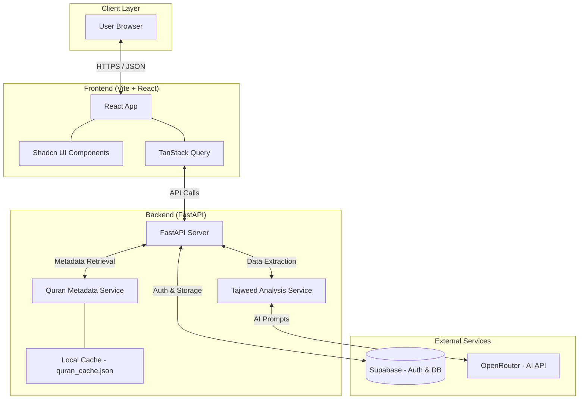

# Yusr System Architecture

Below is the high-level architecture diagram for the Yusr project, illustrating the interaction between the Frontend, Backend, and external services.

### Component Details:
1. **Frontend**: Built with **React** and **Vite**, using **TailwindCSS** for a premium look. It handles user interactions and voice recording for Tajweed.
2. **Backend**: A **FastAPI** application that provides RESTful endpoints. It manages the business logic for Quranic recitation feedback.
3. **Services**:
    * **Tajweed Service**: Interacts with AI models (via **OpenRouter**) to provide feedback on pronunciation.
    * **Metadata Service**: Manages Surah, Ayah, and Ruku data using a local JSON cache for high performance.
4. **Database & Auth**: Powered by **Supabase**, providing secure user authentication and persistent storage for user progress.
5. **AI Core**: Utilizes LLMs to analyze Arabic recitation and provide human-like feedback on Tajweed rules.
