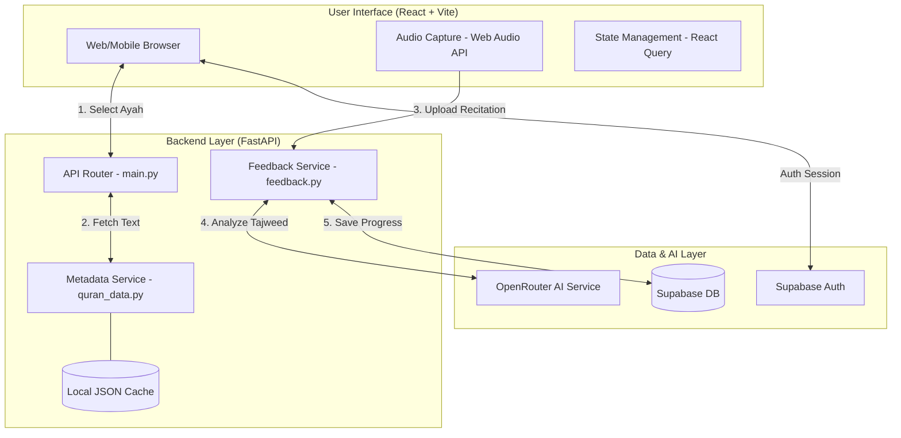
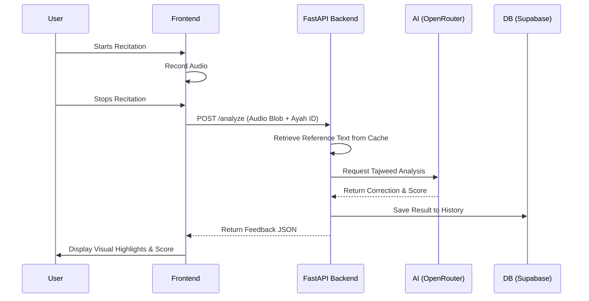

# Yusr System Architecture

Below is the high-level architecture diagram for the Yusr project, illustrating the interaction between the Frontend, Backend, and external services.

## Detailed Workflow (Real-time Tajweed Analysis)

1. **Session Initialization**: The user logs in via **Supabase Auth**. The frontend maintains the session.
2. **Content Selection**: User selects a Surah/Ayah. The frontend fetches the Arabic text and metadata from the **FastAPI** backend, which uses a optimized **Local JSON Cache** for sub-millisecond lookups.
3. **Voice Capturing**: As the user recites, the **Web Audio API** captures the audio stream.
4. **Analysis Request**: The recorded audio is sent to the `/analyze` endpoint of the Backend.
5. **AI Processing**: 
    - The **Feedback Service** prepares the prompt with the reference text.
    - It calls **OpenRouter** (external LLM) to analyze the phonetics and Tajweed rules.
6. **Persistence**: The feedback results (scores, mistakes) are stored in **Supabase PostgreSQL** for history tracking.
7. **Instant Feedback**: The frontend receives the JSON response and highlights the specific words or rules that need improvement using **Framer Motion** animations.

## Sequence Diagram

